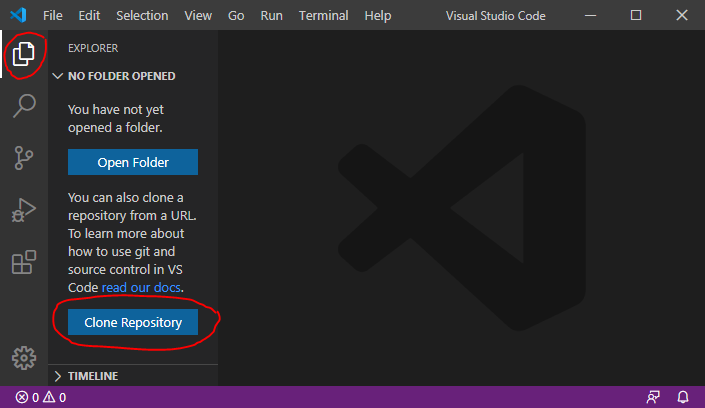
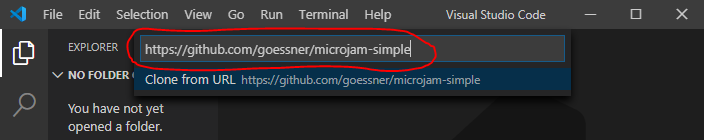
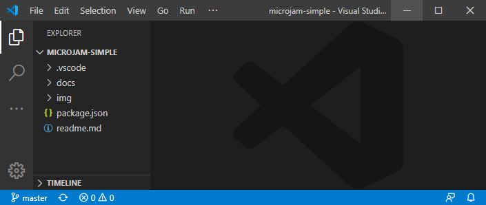

# Cloning Templates

## Prerequisites

It is assumed, that you have
* a registered GitHub account.
* successfully [installed](https://code.visualstudio.com/Download) Visual Studio Code.
* basic knowledge, how to use [*Visual Studio Code*](https://code.visualstudio.com/).
* successfully [installed](https://marketplace.visualstudio.com/items?itemName=goessner.microjam) &mu;Jam extension to VSCode.
* basic knowledge, how to [use &mu;Jam](./usage.html).

## Cloning a Template

Say you want to create a website similar to an already existing website from one of the [basic &mu;Jam template repositories](./usage.html#templates) or others. Than you can

* clone that repository, i.e. create a local copy of a GitHub repository on your computer.
* modify structure, style and content of your local repository.
* publish your local repository to a remote repository under your GitHub account.

Let's go briefly through these steps by cloning the repository [microjam-simple](https://github.com/goessner/microjam-simple) as an example.

> 1. Start VSCode in empty mode &ndash; with no file or folder open.
> 2. Open the *Explorer View*. Here you are offered to  <kbd>*Clone Repository*</kbd>.

<figure>
  
  <figcaption>Fig. 1: Clone Remote Repository.</figcaption>
</figure>

> 3. Press button <kbd>*Clone Repository*</kbd> and enter the template url.

<figure>
  
  <figcaption>Fig. 2: Enter Template Url.</figcaption>
</figure>

> 4. You will be asked to select the local directory, where to copy the template files into.
> 5. After successfully copied the template files you recieve a notification asking you to open the cloned repository.

<figure>
  
  <figcaption>Fig. 3: Copy Success Notification.</figcaption>
</figure>

> 5. You might want to open the cloned repository.

<figure>
  
  <figcaption>Fig. 4: Opened Cloned Repository.</figcaption>
</figure>

> 6. Modifying structure, style and content of your local repository is [described here](file:///C:/git/microjam/docs/usage.html#usage). 
> 7. For publishing your repository to your GitHub account [read here](./usage.html#usage) or here [in more detail](./installationGuide.html#publish-to-the-world).

If you otherwise want to go the direct way to create a remote GitHub repository from an existing template repository you are [guided through this process](https://help.github.com/en/github/creating-cloning-and-archiving-repositories/creating-a-repository-from-a-template) here very well.
