# Creating Serverless Web Pages

This is an installation guide for **&mu;jam**, an extension to [*Visual Studio Code*](https://code.visualstudio.com/). VS Code is a powerful and heavily used open source editor from Microsoft available on Linux, Mac and Windows platforms. The most important feature in this context of website creation and authoring is *VS Code being a highly sophisticated Markdown Editor*.

So in using this installation guide we need only few prerequisites.

* VS Code installed. You can download it from [here](https://code.visualstudio.com/download).
* Install **&mu;jam** ... (todo)
* Minimal knowledge of markdown. Here is an overview of its [basic syntax](https://www.markdownguide.org/basic-syntax/).

You may like to hear that ...

* no programming skills are required.
* initializing and creating websites can be done completely inside of VS Code.
* interested but impatient persons can skip all *Information* and *Explanation* labeled sections below.

We will do that in three simple steps:

1. [A New Project](#1-a-new-project-1)
2. [Generating Content](#2-generating-content-1)
3. [Publish to the World](#3-publish-to-the-world-1)

## 1. A New Project

For a new project we need a project folder, where everything necessary can reside in. For creating that new folder

1. Open a new terminal session right in `vscode` editor.

<figure>
  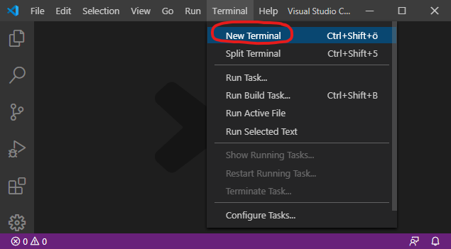
  <figcaption>Fig. 1: Start with a blank editor and open a new terminal session.</figcaption>
</figure>

2. Type in the terminal window the command `mkdir` (`make directory`) and ...   
    specify with it the path to our new project folder `first`.

```
> mkdir <new folder path>
```

> ### **Important** !
> For simplicity reasons the root directory `'/'` is taken here as the location of the project folder. This should be avoided in general and is even restricted under Unix / OSX. Take your `/home` directory instead (`> cd ~`). 

<figure>
  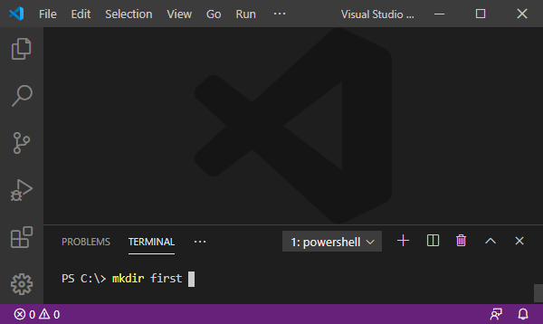
  <figcaption>Fig. 2: Create a project folder.</figcaption>
</figure>

3. We navigate to our newly created folder via `cd` (`change directory`). 
```
> cd <new folder path>
```
<figure>
  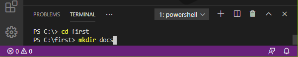
  <figcaption>Fig. 3: Navigate to project folder.</figcaption>
</figure>

We want to create the first file in our nearly empty directory `first`.

4. Select in the menu `File > New File` (<kbd>Ctrl</kbd> + <kbd>N</kbd>).
5. Copy and paste the following text into its window (<kbd>Ctrl</kbd> + <kbd>C</kbd>, <kbd>Ctrl</kbd> + <kbd>V</kbd>). 

```json
{
  "name": "first",
  "description": "My first web page using microjam",
  "version": "0.1.0",
  "author": "it's me",
  "microjam": {}
}
```

6. Save the file via `File > Save As...` (<kbd>Ctrl</kbd> + <kbd>Shift</kbd> + <kbd>S</kbd>) giving it the name `package.json`. Save it into the new project directory `first`.

<figure>
  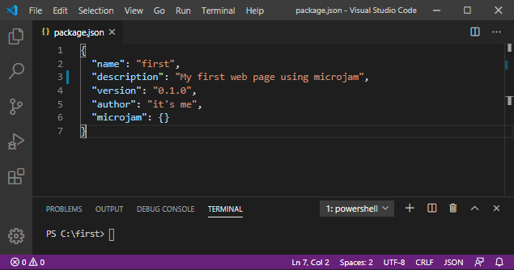
  <figcaption>Fig. 4: Create the 'package.json' file.</figcaption>
</figure>

With that we finished our first step in creating a new project and will proceed in generating some content.


## 2. Generating Content

We now start to write some Markdown documents using `vscode` as markdown editor. 

> ### Information
> **μjam** basically differentiates between three different types of documents:
>
> * `page` represents a stand-alone web page like an `about` page.
> * `article`s are web pages building a consecutive list of entries like *blog posts*.
> * `index` represents the main page, potentially holding a table of contents of all `article` pages.
>
> A certain layout is assigned to each of these three types.

At this moment we have a tiny directory structure:

```
/first
|_ package.json
|_ /docs   (empty folder)
```

### 2.1 `page` Documents

Let's create an `about` page for our first web site. 

1. Copy and paste the following text into a new markdown window (<kbd>Ctrl</kbd> + <kbd>C</kbd>, <kbd>Ctrl</kbd> + <kbd>V</kbd>)

```
---
"layout": "page",
"title": "About"
---

# About this Site 
  
This site was created as a simple collection of markdown files using minimalistic *Static Site Generator* **&mu;jam**.
```
2. Save it to file `about.md` in the new `docs` directory (<kbd>Ctrl</kbd> + <kbd>Shift</kbd> + <kbd>S</kbd>).
3. Show preview window by pressing the *red-circled* preview-button (<kbd>Ctrl</kbd> + <kbd>K</kbd> <kbd>V</kbd>). 

<figure>
  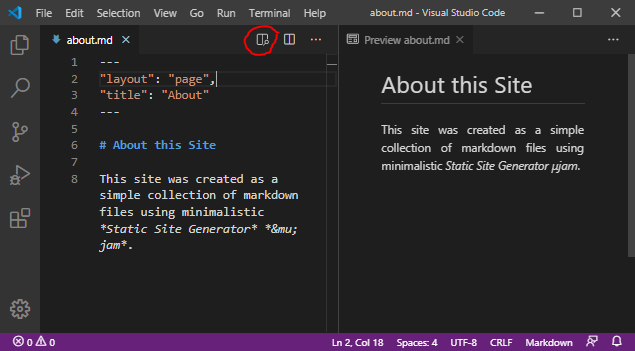
  <figcaption>Fig. 5: Writing the 'about' page document.</figcaption>
</figure>

> ### Explanation
> While working on a markdown file you can always examine the html-result visually side-by-side in a preview window (Fig. 5). Please note some *front matter metadata* at the top of our `about.md` file. These metadata are enclosed between two lines of three dashes `---` and so separated from the following markdown text. That separator style is taken from `yaml`, but the metadata itself has to follow `json`-syntax strictly.

We now want to open our complete project folder in `vscode`.

> ### Explanation
> After having successfully saved `about.md` into the `docs` folder &ndash; which is our *first* content file in this project &ndash; we might have realized, that the project directory structure has changed significantly &ndash; magically. We want to proof that by `vscode`'s  comfortable Explorer View.

4. Switch on the Explorer View by pressing the uppermost symbol of the [*Activity Bar*](https://code.visualstudio.com/docs/getstarted/userinterface#_basic-layout), located on the far left-hand side of the editor. 
5. The Explorer View opens and asks us to `'Open Folder'`. Pressing this button and selecting our directory `/first`, we get a nice view of our folder structure (Fig. 6). At the same time the Status Bar color has turned from *purple* to *blue*.

<figure>
  <div>&nbsp;&nbsp;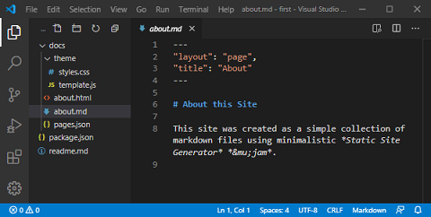</div>
  <figcaption>Fig. 6: Extended project folder structure after saving the first markdown file.</figcaption>
</figure>

> ### Explanation
> * In our `docs` folder two additional files appeared:
>    * all generated `html`-files, which got the filename from their corresponding `md`-files. So we have here `about.html` solely.
>   * `pages.json` holding a list of extended metadata extracted from all markdown files. At that time it contains an array literal including metadata of a single `page`-file now.
> * A new `theme` folder was created inside of `docs`. It contains
>   * `template.json`, which holds the default templates for generating `html`-files from `md`-files.
>   * a single stylesheet file `styles.css` used by `html`-files.
>
> If you want to extend this directory structure, add files or modify your templates &ndash; maybe you want to add some scripts &ndash; you can do this manually at any time from now on. `μjam` won't touch your folder structure and templates anymore. This was an initial one-time action only.

Now you can view your first web page in the browser of your choice.

6. *Drag 'n drop* `about.html` from the editor's Explorer View (Fig. 6) into the browser's adress bar ... and voilà.

<figure>
  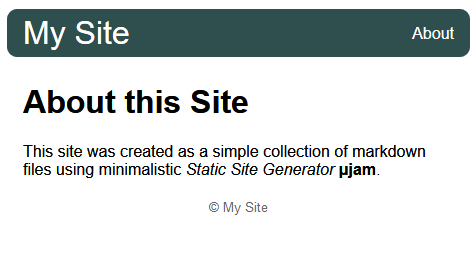
  <figcaption>Fig. 7: About page &ndash; viewed in browser.</figcaption>
</figure>


### 2.2 `article` Documents

We want to maintain a series of `article` documents, possibly as posts for use with a weblog.

> ### Information
>  `article` documents are not so much different from `page` documents. In the *front matter metadata* we need to have a `date` member. Adding a `description` member is recommended. 

The workflow is illustrated now by the creation of two articles:

1. Open a new file via `File > New File` (<kbd>Ctrl</kbd> + <kbd>N</kbd>).
2. Copy and paste the following text into that window (<kbd>Ctrl</kbd> + <kbd>C</kbd>, <kbd>Ctrl</kbd> + <kbd>V</kbd>)
3. Save it to file `one.md` in the `docs` directory (<kbd>Ctrl</kbd> + <kbd>Shift</kbd> + <kbd>S</kbd>).

`one.md`
```
---
"layout": "article",
"title": "Article One",
"description": "This is the first article",
"date": "2020-03-22"
---
### Abstract
This is the first article. We are mainly testing `syntax highlighting` here.

## 1. Syntax highlighting

### 1.1 Html
```html
<!doctype html>
<html>
    <head>
        <title>About</title>
    </head>
    <body>
    <header>header</header>
    <main>
       content here
    </main>
    <footer>footer</footer>
    </body>
</html>
`` `
```

4. Open a new file via `File > New File` (<kbd>Ctrl</kbd> + <kbd>N</kbd>).
5. Copy and paste the following text into that window (<kbd>Ctrl</kbd> + <kbd>C</kbd>, <kbd>Ctrl</kbd> + <kbd>V</kbd>)
6. Save it to file `two.md` in the `docs` directory (<kbd>Ctrl</kbd> + <kbd>Shift</kbd> + <kbd>S</kbd>).

`two.md`
```
---
"layout": "article",
"title": "Article Two",
"description": "This is the second article",
"date": "2020-03-23"
---
### Abstract
This is the second article. Here we are testing math formulas and embedded `svg`.

## 1. Testing

### 1.1 Math Formulas

[Euler's identity](https://en.wikipedia.org/wiki/Euler%27s_identity) is said to be one of the most beautiful formulas, as it collects the most fundamental numbers in mathematics in a compact equation (1).

$$e^{i\pi} + 1 = 0$$ (1)

### 1.2 Vector Graphics

<figure>
<svg width="200" height="100">
   <path d="M100,10L123.5,82.4L61,37.6L138,37.6L76.5,82.4Z" stroke="darkslategray" stroke-width="4" fill="orange"/>
</svg>
  <figcaption>Fig. 1: SVG Star</figcaption>
</figure>
```

<figure>
  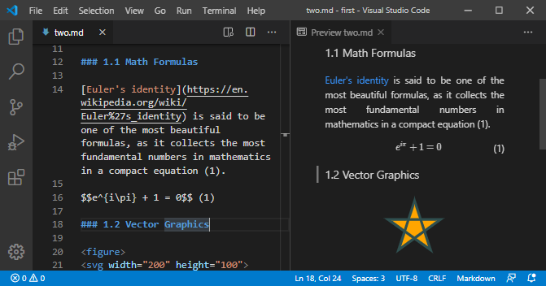
  <figcaption>Fig. 8: Article document 'two.md'.</figcaption>
</figure>

> ### Explanation
> While having saved these two `*.md` documents for the first time, their corresponding `*.html` documents were created and also their *front matter metadata* have been extracted, slightly extended and appended to the list of the pages metadata in `pages.json`. Please note, that `μjam` will update metadata during consecutive files storages and even remove them together with the `*.html` files, when you delete a markdown file manually from the file system.
>
> You also might have noticed that we mixed LaTeX math and SVG markup into our markdown text of file `two.md` (Fig. 8).

### 2.3 `index` Document

Let's create the homepage of our website now.

> ### Information
> Any markdown document marked as `"index"` in its *frontmatter layout* entry will get appended a list of all `article`s immediately after its normal `content` section. 

1. Open a new file via `File > New File` (<kbd>Ctrl</kbd> + <kbd>N</kbd>).
2. Copy and paste the following text into that window (<kbd>Ctrl</kbd> + <kbd>C</kbd>, <kbd>Ctrl</kbd> + <kbd>V</kbd>)
3. Save it to file `index.md` in the `src` directory (<kbd>Ctrl</kbd> + <kbd>Shift</kbd> + <kbd>S</kbd>).

```
---
"layout": "index",
"title": "My Site",
"date": "2020-03-24",
"description": "Homepage of microjam demo site",
"tags": ["microjam","Jamstack","static page","personal",   
         "student","academics","math","vector graphics"],
"category": ["web","math","graphics"]
---

This is a demo site containing some articles. It was made by **μjam**, a minimalistic static site generator.
```
<figure>
  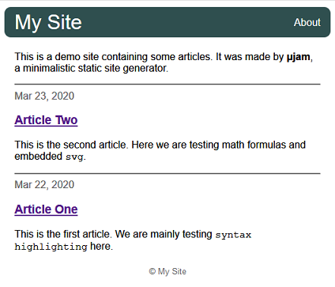
  <figcaption>Fig. 9: Index page.</figcaption>
</figure>

> ### Explanation
> Since both `article` documents have `abstract` sections, that content is used for articles' short description. In case of a missing `abstract` section, the `description` entry from *frontmatter metadata* would have been taken instead.

The content generation process of the demo site is complete now.


## 3. Publish to the World

We want to use well known [GitHub](https://www.edureka.co/blog/how-to-use-github/) here.
And we want this *version control hosting platform* be connected with our local project repository via `vscode`.

> ### Information
> *GitHub* as a highly used platform is a code sharing service. But in contrast to mere cloud storage providers GitHub primarily supports project work, where files are regularly edited, uploaded and needed to be managed through version control. This is exactly, what we want to have with our website project and best of all: GitHub provides us with an online repository for free. We then simply have a storage space, called *repository*, where our project resides on the web. This is not a classical webserver. In the sense of *Jam* it is a CDN &ndash; *content delivery network*.

### 3.1 Creating a Local Git Repository

[Git](https://git-scm.com/) is a powerful version control tool, which allows us to create and manage a *local repository*. 

> ### Information
> With it we then have a **version control tool** *Git* collaborating with the **version control hosting platform** *GitHub*. 
And Visual Studio Code comes with *source control integration* and especially has excellent [Git support](https://code.visualstudio.com/docs/editor/versioncontrol#_git-support). 

> ### **Important** !
> Chances are good that Git is already installed on your local machine. Input `'> git --version'` at your terminal command line. will show you the current version installed.
Otherwise, if you are told that `git` is unknown, you need to install it. Don't worry, this can be easily done by visiting that [download site](https://git-scm.com/downloads). I will wait here.

1. Navigating to the third symbol of the left vertical [*Activity Bar*](https://code.visualstudio.com/docs/getstarted/userinterface#_basic-layout) ... press it.
2. Press the blue button named `'Initialize Repository'`.
3. Type in the commit message `'Initial commit'`.
4. <kbd>Ctrl</kbd> + <kbd>Enter</kbd> or ...
    * Move the mouse over `'CHANGES'` saying *Stage All Changes*.
    * Press the `+` sign.
    * Press the *check mark*.

<figure>
  <span>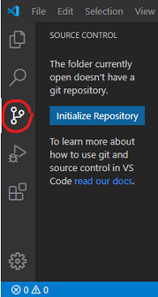&nbsp;&nbsp;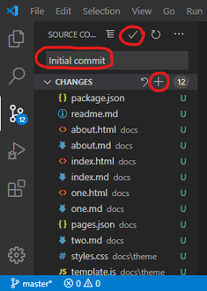&nbsp;&nbsp;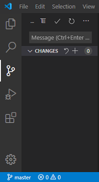</span>
  <figcaption>Fig. 10: Initialize local git repository</figcaption>
</figure>

> ### Explanation
> * By initializing our local repository we added a hidden directory named `.git` to our project folder. Fortunately, we don't have to worry about it at all. 
> * In the source control view with step 3 we see our 12 files labeled `U`, which stands for *untracked file*. 
> * After `Stage All Changes` in step 4 all files were labeled `A` then, meaning *added* to the repository.
> * After step 5 all files vanished from git view, meaning that git took complete control over their versioning from now on. No changes to files can be seen.
> 
> To learn more here, I recommend reading [1](#1) [4] and [5].

How helpful git now is for us becomes apparent, when we change the content of ... say `one.md` and then save the file (<kbd>Ctrl</kbd> + <kbd>S</kbd>).

<figure>
  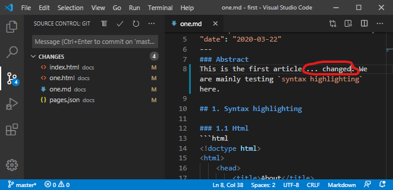
  <figcaption>Fig. 11: Index page.</figcaption>
</figure>

> ### Explanation
> The git view shows four files labeled `M`, meaning *modified*. 
> 1. We changed `one.md` manually. 
> 2. While saving it, `one.html` was newly created/overwritten.
> 3. `pages.json` was modified automatically.
> 4. Since `one.md` is an `article` file, the article list of `index.html` is potentially affected and file `index.html` was updated.
>
> Steps 1-3 are always performed under the hood by **μjam** on markdown file storage.

We can again directly commit these changes now or do that later, while going on and continue to work on other markdown source files.


### 3.2 Online Repository

You want to see your pages online now? So you need a personal *user GitHub account* for proceeding.

> ### **Important** !
> If you do not have a personal user GitHub account, you need to [sign up for a new free GitHub account here](https://help.github.com/en/github/getting-started-with-github/signing-up-for-a-new-github-account) .
> Please also note, that you are requested to provide a working email address during verification process.

Now that you are the owner `<username>` of a GitHub account ...

1. Navigate your personal browser to `https://github.com/<username>`.
2. In the upper-right corner of that GitHub page, use the `+` drop-down menu, and select `New repository`.

<figure>
  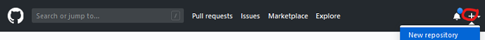
  <figcaption>Fig. 12: Homepage of your GitHub account.</figcaption>
</figure>

3. Fill out the formular ...
    * Take a short, memorable `<repository name>` like `'first'`.
    * Description: `'First microjam powered web site'` or similar text.
    * Choose *public* or *private*.
    * Leave the rest as it is.
    * Press button *Create repositiory*.

<figure>
  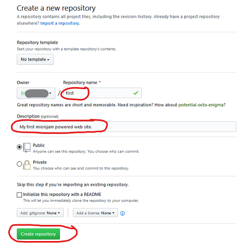
  <figcaption>Fig. 13: Formular: Create a new repository.</figcaption>
</figure>

3. In a new browser tab/window navigate to `https://api.github.com/users/<username>` .
4. Copy your `<github user id>` from the second line (a series of 6 or more decimal digits) (<kbd>Ctrl</kbd> + <kbd>C</kbd>) [3].
5. In the terminal window (on the command line), type:    
```
> git config --global user.name <github user id>
> git remote add origin https://github.com/<username>/<repository name>.git
> git push -u origin master
```
> ### Explanation
> Please note, that use of these terminal commands is necessary for the first time file transfer to GitHub only. So having done that once, you can forget it forever.

The result of that action on your GitHub account page will be something like this ... (refresh page!)

<figure>
  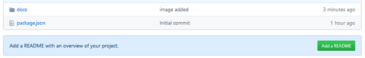
  <figcaption>Fig. 14: Successfully pushed our repository to GitHub.</figcaption>
</figure>

We will take care about the *README* in a minute. Now we can't wait to see our website online.

6. Select `settings` on your GitHub account page.
7. Scroll down to `GitHub Pages`.
8. In `Select source` set checkmark at `master branch / docs folder`. 
9. Navigate to the url shown at `'Your site is published at'`. 

<figure>
  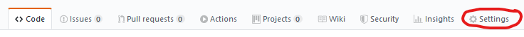
  <br>
  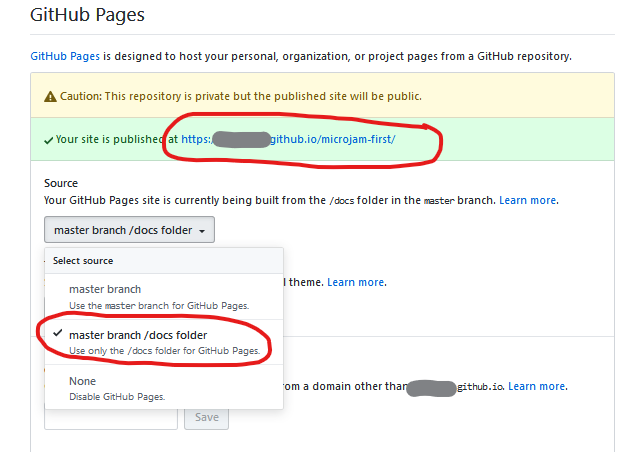
  <figcaption>Fig. 15: Activate GitHub Pages.</figcaption>
</figure>

**Congrats, your first website is online now !**


### 3.3 The Final Workflow

I would like to show you how working at your website looks like from now on. We will return to our `vscode` editor and ...

1. Add a `readme.md` file (content below) as requested and save (<kbd>Ctrl</kbd> + <kbd>Shift</kbd> + <kbd>S</kbd>).
```
# A minimal sample repository for *&mu;jam*
```
2. Modify the content of `one.md` again and save (<kbd>Ctrl</kbd> + <kbd>S</kbd>).
3. Type in a *commit message* `'Add readme'` (<kbd>Ctrl</kbd> + <kbd>Enter</kbd>).
4. In a possibly upcoming `vscode` message window `Would you like to automatically ...` select `Always` .
5. In status bar select either the little `cloud` or the `up-arrow` symbol for uploading the changed files to GitHub.

<figure>
  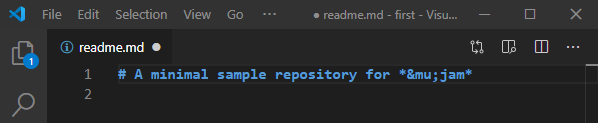
  <br>
  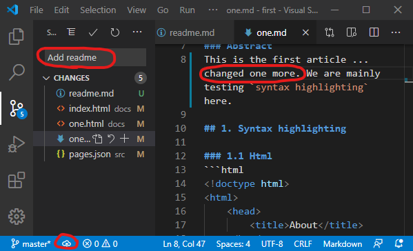
  <br>
  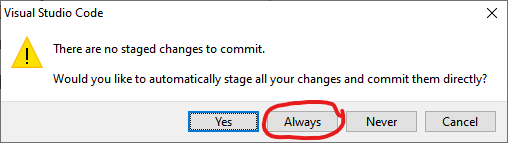
  <br>
  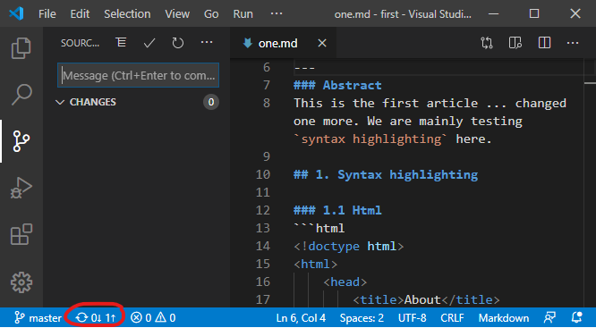
  <figcaption>Fig. 16: Workflow: Adding 'readme.md' and modifying 'one.md'.</figcaption>
</figure>

That's it. Please verify the arrival of the readme file at Github and the successful update of your website.

Steps `2-3-5` above i.e. 

* modify content 
* type commit message
* upload to GitHub

is all you need to do from now on. 

Good question &ndash; thanks &ndash; this installation guide was in fact authored by **&mu;jam** &ndash; during a process called [*dogfooding*](https://en.wikipedia.org/wiki/Eating_your_own_dog_food) `:)`.

*Happy publishing ...*   
`--`   
Stefan G.

## References 

[1] [jamstack.wtf](https://jamstack.wtf/)   
[2] [Not Your Dad's IT](http://www.notyourdadsit.com/blog/2018/4/3/cheatsheet-setup-github-on-visual-studio-code)    
[3] [Where can I find the GitHub ID in my account?](https://stackoverflow.com/questions/17308954/where-can-i-find-the-github-id-in-my-account/40695228)    
[^4]: [Version Control Basics with Github and VS Code](https://medium.com/@brygrill/version-control-basics-with-github-and-vs-code-1c1906cadd33)  
[5] [Version Controlling with Git in Visual Studio Code and GitHub](https://azuredevopslabs.com/labs/azuredevops/github/)  
[6] [Versionskontrolle mit Git auf einem Hoster wie GitHub, GitLab, BitBucket unter Visual Studio Code einrichten](https://machine-learning-blog.de/2019/10/03/versionskontrolle-mit-git-auf-einem-hoster-wie-github-gitlab-bitbucket-unter-visual-studio-code-einrichten/)   
[7] [Git Integration in Visual Studio Code](https://www.digitalocean.com/community/tutorials/git-integration-in-visual-studio-code)

