# Usage

## Prerequisites

It is assumed, that you 
* have basic knowledge, how to use [*Visual Studio Code*](https://code.visualstudio.com/).
* successfully [installed](./installationGuide.html) **&mu;Jam** extension to VSCode.

## Activation

&mu;Jam is an extension to VSCode and VSCode will activate it under certain conditions. As &mu;Jam deals primarily &ndash; or more precise exclusively &ndash; with markdown files, it will get activated, when you either

* open your first markdown file, or ...
* start VSCode with a markdown file as its active document

<figure>
  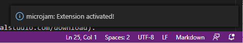
  <figcaption>Fig. 1: &mu;Jam activation message.</figcaption>
</figure>

You will see an activation message in the lower right corner of VSCode window.
You do not necessarily have your repository folder opened in VSCode. &mu;Jam will work with single file mode also.

But ... having &mu;Jam activated properly does not mean, it works with every markdown file. It accepts files 

* being in a `docs` directory or one of its subdirectories `docs/**` and ...
* belonging to a repository having an entry `"microjam": {...}` in its `package.json`

only.

## Generating Webpages

&mu;Jam can do exactly *two things* for you:

* generate/update a `html` file from a single `md` file ...
* generate/update `html` files from **all** `md` files in a repository

### Single Markdown Files

Whenever you are working at a markdown file and save it via

* menu `File > Save As` or (<kbd>Ctrl</kbd> + <kbd>Shift</kbd> + <kbd>S</kbd>) or ...
* menu `File > Save` or (<kbd>Ctrl</kbd> + <kbd>S</kbd>)

its corresponding `html` file will be generated automatically by &mu;Jam, which will also update the `pages.json` file and possibly some *index* files, if you happened to have modified a `"layout":"article"` document.

<figure>
  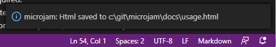
  <figcaption>Fig. 2: &mu;Jam Html saved message.</figcaption>
</figure>

> **Note:**   
>That `File > Save` command **only** saves its markdown file, if it has been modified since its last storage command. Only in this case the corresponding `html` file is updated.

In order to assist you to *force an update of a single file*, &mu;Jam provides us with the command <kbd>Ctrl</kbd>&nbsp;+&nbsp;<kbd>K</kbd>&nbsp;&nbsp;<kbd>H</kbd> (think **H**tml). This is also available via different menus (see below).

### All Markdown Files

There might come up the necessity to rebuild all `html` files. One scenario is, we just had modified our templates in `template.js`.

To achieve this, we can use the &mu;Jam command <kbd>Ctrl</kbd>&nbsp;+&nbsp;<kbd>K</kbd>&nbsp;&nbsp;<kbd>A</kbd> (think **A**ll).

<figure>
  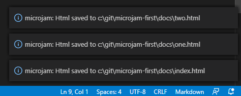
  <figcaption>Fig. 3: &mu;Jam command - force rebuild all Html files</figcaption>
</figure>

Please note, only the last three rebuilt files are are visible after completion as &mu;Jam messages then.

### Menus

<figure>
  <div>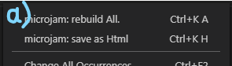
  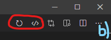</div><br>
  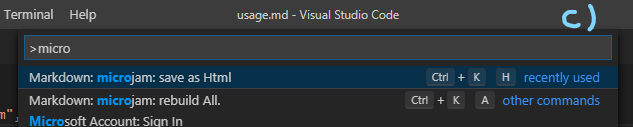<br>
  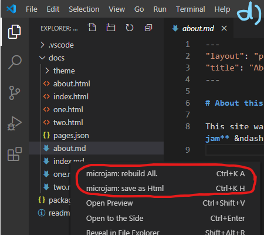
  <figcaption>Fig. 4: &mu;Jam commands - accessible through different menus</figcaption>
</figure>

Both &mu;Jam commands are accessible through

1. Editor context menu (right click) (a)
2. Editor title menu (b)
3. VSCode global command palette (c)
4. Explorer context menu (d)

> **Note:**   
>Menus in VSCode are defined statically with extensions like &mu;Jam. So above menus are always shown while editing any markdown document. But with markdown documents **not** belonging to a valid repository invoking these menu commands will **silently** have no effect.

### Manually Remove Files

You won't want to remove auto-generated files usually, as they are regularly updated by &mu;Jam. But if you explicitely want to do that, it you can use the explorer view (Fig. 5).

<figure>
  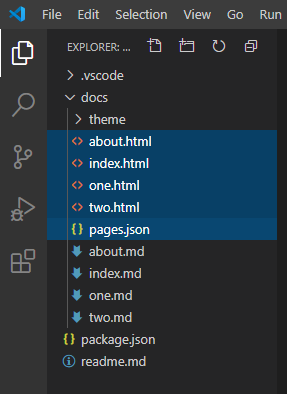
  <figcaption>Fig. 5: Explorer view - manually remove these files only</figcaption>
</figure>

* It is safe to remove all `*.html` files as well as `pages.json` (<kbd>Delete</kbd> or <kbd>Shift</kbd>+<kbd>Delete</kbd>).
* If you manually remove a markdown file, its corresponding `html` file will be consistently deleted by &mu;Jam during next command execution. `pages.json` will be also updating accordingly.
* You can delete the `docs/theme` folder and even the `.vscode` directory. &mu;Jam will generate them again using default content. But be aware, that possible customizations or ccopies get lost then. You usually don't want to do that.
* You shouldn't delete any other files from your repository, except you know, what you are doing.

> **Note:**   
>Sort order of files by *type* makes sense in explorer view, but it's not VSCode's default order. So &mu;Jam adds an entry `"explorer.sortOrder":"type"` to user settings file `.vscode/settings.json`. You can add more individual settings to that file.

## Editing Markdown Files

It is not much to say here, since markdown editing is excellently done by VSCode editor. There are only a few assisting &mu;Jam features worth mentioning.

### Frontmatter Snippet

When starting a new markdown file, &mu;Jam assists you by inserting a partial filled *frontmatter* template at current editor location.

<figure>
  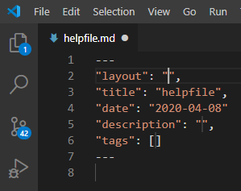
  <figcaption>Fig. 6: Auto-create frontmatter snippet sceleton</figcaption>
</figure>

Simply type <kbd>Ctrl</kbd>+<kbd>k</kbd> <kbd>-</kbd> for getting this.

### Table Of Content Snippet

When finishing a markdown document containing several headings possibly in multiple levels, we would welcome an automatic generation of a table of contents (toc). This is inserted at current editor location by &mu;Jam at our fingertips.

<figure>
  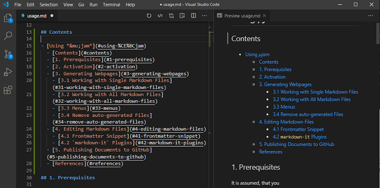
  <figcaption>Fig. 7: Auto-create table of content</figcaption>
</figure>

Simply type <kbd>Ctrl</kbd>+<kbd>k</kbd> <kbd>t</kbd> (think &nbsp;**t**oc) for getting this.

> **Note:**   
> The table of content inserted is static and not configurable, i.e. minimalistic:
> * If you do not want to have a heading in the toc (maybe 'Contents'), simple delete it from the generated list in the markdown document.
> * Generating certain toc levels only is not supported. Simply remove the unwanted entries manually then.
> * If you edit the text of a heading, the toc won't update automatically. Recreate the toc then manually.
> * Headings in markdown code sections are incorrectly inserted also. You need to remove them manually.

### Navigation List Snippet

Sometimes we do not want to have an internal table of content, but an external navigation list. With that we might compose a navigation sidebar. In this case we want to have explicite local `html` url's, as in ...

```md
- [Installation](installationGuide.html#installation)
  - [A New Project](installationGuide.html#a-new-project)
  - [Generating Content](installationGuide.html#generating-content)
  - [Publish to the World](installationGuide.html#publish-to-the-world)
```

For getting this we type <kbd>Ctrl</kbd>+<kbd>k</kbd> <kbd>n</kbd> (think &nbsp;**n**av).

### Permalinks

This feature is shamelessly copied from GitHub. In the browser ... whenever you are hovering with your pointer device a heading, a small symbol appears. Hovering then over that symbol, the document-local uri of the heading in question can be copied (right click) and is shown in the status bar at the same time.

<figure>
  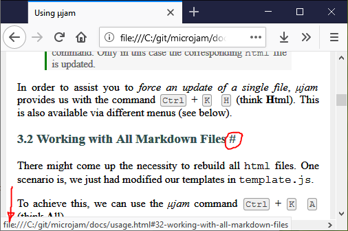
  <figcaption>Fig. 8: Explorer view - manually remove these files only</figcaption>
</figure>

With this feature enabled, your visitors can copy and paste that location and thus link into your pages with the help of these *permalinks*.

In order to activate this feature, you need to add

```markdown
---
"permalink": "#"
---
```
to your page's frontmatter section. You are allowed to take a character symbol of your choice. `"permalink": true` is also possible, with '#' as the default symbol.

### `markdown-it` Plugins

VSCode uses [markdown-it](https://github.com/markdown-it/markdown-it) as its markdown parser internally and so does &mu;Jam. There are a lot of markdown-it plugins available.
&mu;Jam potentially supports only two of them at current:

* Math plugin `markdown-it-texmath`
* Footnotes plugin `markdown-it-footnotes`

Since they are both inactive initially, we can activate them &ndash; if we want &ndash; by appending the following to `.vscode/settings.json` ...

```json
"microjam.markdownItPlugins": {
  "markdown-it-texmath": {
    "engine": "katex",
          "delimiters": "dollars",
          "macros": {"\\RR": "\\mathbb{R}"}
  },
  "markdown-it-footnote": {}
}
```
Extending &mu;Jam, in using other markdown-it plugins is possible, but out of the scope of this user manual. 

## Publishing to GitHub

We are assuming here, that you have a valid local `git` and remote GitHub repository already. Read [installation guide](./installationGuide.html) otherwise.

<figure>
  
  <figcaption>Fig. 16: Workflow: Adding 'readme.md' and modifying 'one.md'.</figcaption>
</figure>

For publishing your generated or modified files to GitHub, you might want to use the *Source control* view.

* Type in a commit message string.
* Send it by <kbd>Ctrl</kbd> + <kbd>Enter</kbd>.
* Press the *up arrow* symbol in the status bar.


## The Usual Workflow

I would like to show you how working at your website looks like, once you installed all and already wrote your markdown files.

1. You will again open your project directory `first`, which already has the following structure

```
/first
|_ package.json
|_ /docs
   |_ /theme
   |_ index.html
   |_ one.html
   |_ two.html
   |_ pages.json
   |_ index.md
   |_ one.md
   |_ two.md
```

2. Add a `readme.md` file (content below) and save it (<kbd>Ctrl</kbd> + <kbd>Shift</kbd> + <kbd>S</kbd>) to your project root folder. Its content might be somewhat like
```
# A minimal sample repository for &mu;Jam
```
3. Modify the content of `one.md` and save (<kbd>Ctrl</kbd> + <kbd>S</kbd>).
4. Type in a *commit message* `'Add readme'` (<kbd>Ctrl</kbd> + <kbd>Enter</kbd>).
5. In a possibly upcoming `vscode` message window `Would you like to automatically ...` select `Always` .
6. In the VSCode status bar select either the little `cloud` or the `up-arrow` symbol for uploading the changed files to GitHub.

<figure>
  
  <br>
  
  <br>
  
  <br>
  
  <figcaption>Fig. 16: Workflow: Adding 'readme.md' and modifying 'one.md'.</figcaption>
</figure>

That's it. Please verify the arrival of the readme file at Github and successful update of your website.

Steps `2-3-5` above i.e. 

* modify content 
* type commit message
* upload to GitHub

is all you need to do from now on. 

Just to mention &ndash; this documentation was authored by **&mu;Jam** during a process called [*dogfooding*](https://en.wikipedia.org/wiki/Eating_your_own_dog_food) `:)`.

*Happy publishing ...*   

## Templates

* [microjam-simple](https://github.com/goessner/microjam-simple) &ndash; A simple website template for μJam
* [microjam-tufte](https://github.com/goessner/microjam-tufte) &ndash; A Tufte Style Template for μJam
* [microjam-docs](https://github.com/goessner/microjam-docs) &ndash; A documentation theme for μjam with sidebar
* [microjam-g2](https://github.com/goessner/microjam-docs) &ndash; A theme for μjam + g2


## Keyboard Commands 

| Command |  Mnemonic  | Menu | Action |
|:------|:--------|:-----|:----|
| <kbd>Ctrl</kbd>&nbsp;+&nbsp;<kbd>K</kbd>&nbsp;&nbsp;<kbd>H</kbd> | **H**tml | &ndash; | Generate single Html file |
| <kbd>Ctrl</kbd>&nbsp;+&nbsp;<kbd>K</kbd>&nbsp;&nbsp;<kbd>A</kbd> | **A**ll | &ndash; | Generate all Html files |
| <kbd>Ctrl</kbd>&nbsp;+&nbsp;<kbd>K</kbd>&nbsp;&nbsp;<kbd>-</kbd> | --- | &ndash; | Insert frontmatter template |
| <kbd>Ctrl</kbd>&nbsp;+&nbsp;<kbd>K</kbd>&nbsp;&nbsp;<kbd>T</kbd> | **T**oC | &ndash; | Insert Table of Contents |
| <kbd>Ctrl</kbd>&nbsp;+&nbsp;<kbd>K</kbd>&nbsp;&nbsp;<kbd>N</kbd> | **N**av | &ndash; | Copy navigation markdown to clipboard |
| |
| <kbd>Ctrl</kbd>&nbsp;+&nbsp;<kbd>K</kbd>&nbsp;&nbsp;<kbd>V</kbd> | pre**V**iew | &ndash; | Open preview window |
| <kbd>Ctrl</kbd> + <kbd>Enter</kbd> | &ndash; |  &ndash; | Commit Changes |
| <kbd>Ctrl</kbd> + <kbd>Shift</kbd> + <kbd>S</kbd> | **S**ave A**s** |`File > Save As` | Save file as ... |
| <kbd>Ctrl</kbd> + <kbd>S</kbd> | **S**ave |`File > Save` | Save file |
| <kbd>Ctrl</kbd> + <kbd>C</kbd> | **C**opy |`Edit > Copy` | Copy text to clipboard |
| <kbd>Ctrl</kbd> + <kbd>V</kbd> | Paste |`Edit > Paste` | Retrive text from clipboard |

Apple users will press the <kbd>Cmd</kbd> key instead of the <kbd>Ctrl</kbd> key.


## References 

[1] [jamstack.wtf](https://jamstack.wtf/)   
[2] [Not Your Dad's IT](http://www.notyourdadsit.com/blog/2018/4/3/cheatsheet-setup-github-on-visual-studio-code)    
[3] [Where can I find the GitHub ID in my account?](https://stackoverflow.com/questions/17308954/where-can-i-find-the-github-id-in-my-account/40695228)    
[4]: [Version Control Basics with Github and VS Code](https://medium.com/@brygrill/version-control-basics-with-github-and-vs-code-1c1906cadd33)  
[5] [Version Controlling with Git in Visual Studio Code and GitHub](https://azuredevopslabs.com/labs/azuredevops/github/)  
[6] [Versionskontrolle mit Git auf einem Hoster wie GitHub, GitLab, BitBucket unter Visual Studio Code einrichten](https://machine-learning-blog.de/2019/10/03/versionskontrolle-mit-git-auf-einem-hoster-wie-github-gitlab-bitbucket-unter-visual-studio-code-einrichten/)   
[7] [Git Integration in Visual Studio Code](https://www.digitalocean.com/community/tutorials/git-integration-in-visual-studio-code)   
[8] [CommonMark - Specification of Markdown](https://commonmark.org/)
[9] [Configuring a custom domain for your GitHub Pages site](https://help.github.com/en/github/working-with-github-pages/configuring-a-custom-domain-for-your-github-pages-site)

