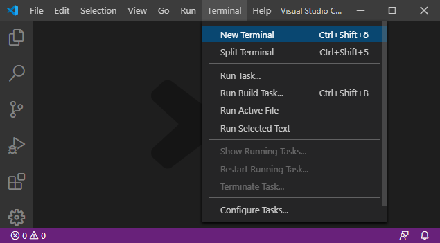
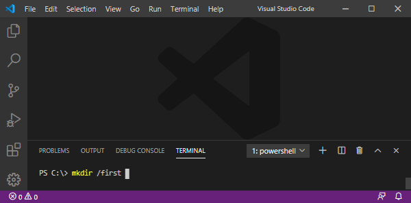
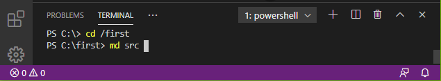

---
  "title": "Creating Web Pages with &mu;-Jam",
  "description": "A Generalized Approach to Parameterizing Planar Elliptical Arcs.",
  "tags": ["2D Vector","Graphics","Web","SVG","HTML Canvas","Path Segment"],
  "category": ["math"],
  "date": "2018-04-13",
  "template": "article"
...
# Creating Web Pages with &mu;-Jam

## A new Project

Open a new terminal session right in the editor.

<figure>
  
  <figcaption>Fig. 1: Starting with a blank editor and open a new terminal session.</figcaption>
</figure>

In order to create a new project folder we type on the command line the command `md` (`make directory`).

```
> md <new folder path>
```
<figure>
  
  <figcaption>Fig. 2: Create a project folder.</figcaption>
</figure>

We named our project `first` and created a project folder `/first` accordingly. Now let's navigate to our newly created folder via `cd` (`change directory`).

```
> cd <new folder path>
```
<figure>
  
  <figcaption>Fig. 3: Navigate to project folder.</figcaption>
</figure>


