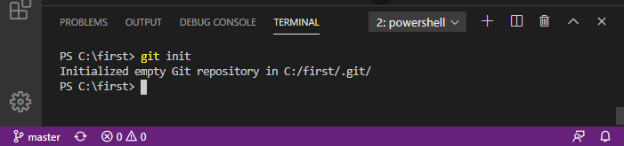

---
  "title": "Creating Web Pages with &mu;-Jam",
  "description": "A Generalized Approach to Parameterizing Planar Elliptical Arcs.",
  "tags": ["2D Vector","Graphics","Web","SVG","HTML Canvas","Path Segment"],
  "category": ["math"],
  "date": "2018-04-13",
  "template": "article"
...
# Creating Web Pages with &mu;-Jam

## A new Project

Open a new terminal session right in the editor.

<figure>
  
  <figcaption>Fig. 1: Starting with a blank editor and open a new terminal session.</figcaption>
</figure>

In order to create a new project folder we type in the terminal window the command `md` (`make directory`).

```
> md <new folder path>
```
<figure>
  
  <figcaption>Fig. 2: Create a project folder.</figcaption>
</figure>

We named our project `first` and created a project folder `/first` accordingly. Now let's navigate to our newly created folder via `cd` (`change directory`).

```
> cd <new folder path>
```
<figure>
  
  <figcaption>Fig. 3: Navigate to project folder.</figcaption>
</figure>

`vscode` has an excellent [`git` support](https://code.visualstudio.com/docs/editor/versioncontrol#_git-support). Never heard about that ... no problem. Simply let's try out and ...

* test if it's installed.
* show how it works.

Use it via

```
> git init
```
<figure>
  
  <figcaption>Fig. 4: Initialize git support.</figcaption>
</figure>

The previous `git init` command created a new subdirectory `.git`. We are lucky in that we need not to care about it anymore.
In the next step we will create our first file in our nearly empty folder: `package.json`.

```json
{
  "name": "first",
  "description": "My first web page using microJam",
  "version": "0.1.0",
  "microJam": {}
}
```