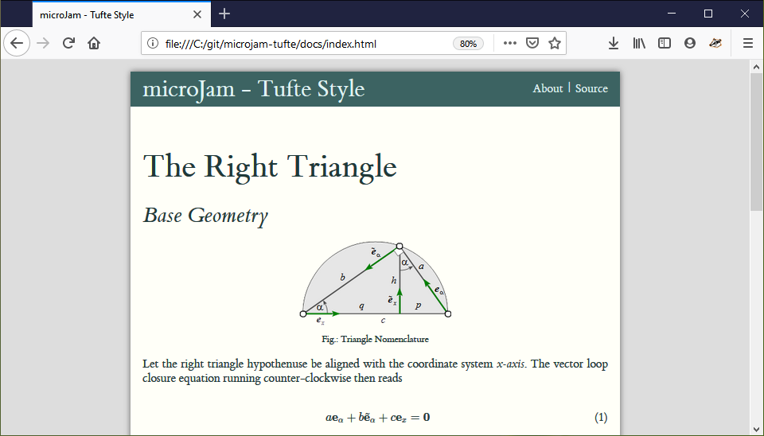
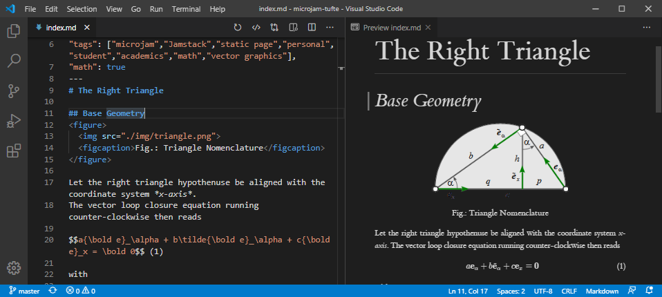

#  &mu;Jam

## What is it ?

Greek letter `'μ'` is pronounced `'my'` as in `micro`, `'mu'` as in `'music'` or `'mee'` according to [modern Greek](https://www.thoughtco.com/the-greek-alphabet-1705558). In that context here it simply means *tiny* or  *minimalistic*.

That `'Jam'` in &mu;Jam comes from `Jamstack` and means the collection of the three attributes
* **J** avaScript
* **A** PI
* **M** arkup

It is mostly about the creation of static web pages or *serverless* websites and you might want to [read more](https://jamstack.org/) about that modern way to build lightweight web pages [here](https://jamstack.wtf/) and [there](https://jamstack.email/).

## What can I do with it ?

If you want to 
* create a small to medium website
* write down the contents of your web pages in that easy to learn and use [Markdown language](https://commonmark.org/help/)
* publish your web-pages to your GitHub repository and [GitHub pages](https://pages.github.com/)
* do that all from inside free [*Visual Studio Code*](https://code.visualstudio.com/) (`vscode`) editor

then the minimalistic and powerful approach of &mu;Jam might convice you.

<figure>
  
  <figcaption>Fig. 1: Resulting Browser View.</figcaption>
</figure>

<figure>
  
  <figcaption>Fig. 2: VSCode Editor View.</figcaption>
</figure>

## Why yet another Jamstack Approach ?

**&mu;Jam** is meant to be a [low code](https://en.wikipedia.org/wiki/Low-code_development_platform) authoring and  web publishing tool for scientists, engineers and students, which ...

> *  is easy to learn and use.
> *  does not require web programming skills.
> *  can handle LaTeX math expressions natively.
> *  integrates static or dynamic vector graphics.
> *  integrates scripting capabilities.
> *  offers comfortable Html previewing.
> *  supports different templates and styles.
> *  enables high quality research paper `pdf`-format output.
> *  doing that all inside of a professional markdown authoring application.

But as you can easily leave that *math*, *vector graphics* and *research paper* stuff out, it may serve your non-academic publishing wishes also well.

Interested ... ?  So [read on](https://goessner.github.io/microjam/index.html) ...
