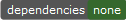

#  &mu;Jam

* ## &mu; ... what ?

Greek letter `'μ'` is pronounced `'my'` as in `micro` or `'mee'` according to [modern Greek](https://www.thoughtco.com/the-greek-alphabet-1705558) .

* ## ok ... myJam ?

`'Jam'` comes from `Jamstack` and means the collection of the three attributes
* **J** avaScript
* **A** PI
* **M** arkup

It is mostly about the creation of *serverless* websites and you might want to [read more](https://jamstack.org/) about that modern way to build lightweight web pages [here](https://jamstack.wtf/).

* ## what can I do with ... &mu;Jam ?

If you want to 
* create a small to medium web site
* write down the contents of your web pages in the easy to learn and use Markdown language
* publish your web-pages to your GitHub repository and GitHub pages
* do that all from inside free [*Visual Studio Code*](https://code.visualstudio.com/) (`vscode`) editor

then the minimalistic and powerful approach of *&mu;jam* might convice you.

* ## ok, how can I try out your ... &mu;Jam approach ?

At first you need to install a few things. Chances are that you already installed [VSCode editor](https://code.visualstudio.com/Download). First read about creating the webpages of [this repository](https://goessner.github.io/microjam-first/) step-by-step by yourself manually in three simple steps:

1. [A new Project](https://goessner.github.io/microjam/installationGuide.html#1-a-new-project-1)
2. [Generating Content](https://goessner.github.io/microjam/installationGuide.html#2-generating-content-1)
3. [Publish to the World](https://goessner.github.io/microjam/installationGuide.html#3-publish-to-the-world-1)

* ## ok, installed everything ... where is the users guide?

Welcome on board ... here is the [users guide](https://goessner.github.io/microjam/usage.html).
